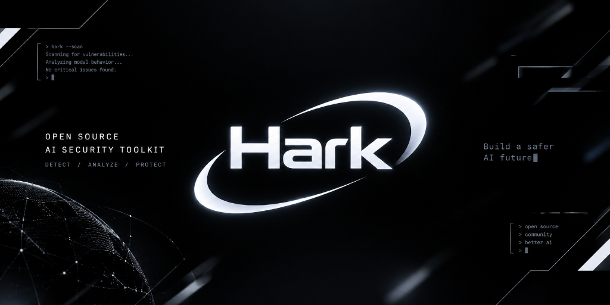

# Hark Agent Mobile (Hark)

<p align="center">
  
</p>

<p align="center">
  
</p>

<p align="center">
  <b>极速、全能、拥有独立 Linux 终端运行环境与任务规划引擎的移动端自主 AI Agent</b>
</p>

<p align="center">
  <a href="https://github.com/Minglink/hark-agent-mobile/releases"></a>
  <a href="LICENSE"></a>
  <a href="#"></a>
  <a href="https://qm.qq.com/cgi-bin/qm/qr?k=&jump_from=webapi&authKey=&noverify=0&group_code=338431075"></a>
</p>

---

## 🌟 什么是 Hark Agent Mobile？

**Hark** 是专为移动终端设计的自主 AI 智能体应用。与单纯的聊天机器人或套壳 API 客户端不同，**Hark 为 AI 赋予了一台属于它自己的真实移动端计算机与独立 Linux 沙箱环境**。

模型不仅能够对话，还能主动安装软件、编写与运行脚本、自动化浏览网页、自发规划复杂多步骤任务、管理上下文记忆，并通过多子代理团队协作与自定义提示词深度满足专业开发与日常自动化需求。

---

## 🔥 核心特性与架构能力

### 1. 真正的设备端独立 Linux 沙箱（PRoot / iSH）
- **真·终端环境**：内置沙箱运行真实的 Alpine Linux 用户空间，无需 Root 权限即可无缝运转。
- **开箱即用包管理**：支持通过 `apk add` / `pip install` 安装任意 CLI 工具（Python、Git、cURL、Wget 等）并在独立沙箱进程中无冲突执行。
- **后台命令流与实时监控**：配备独立的 CPU / MEM 资源 HUD 悬浮监控与控制台输出折叠。

### 2. 👥 多子代理团队协同（Multi-Subagent Team Collaboration）
- **分布式任务拆解**：主代理可根据任务复杂度，自发生成多个轻量化子代理（Subagent）并行处理复杂任务，内置团队 DAG 有向无环图调度器（`TeamTaskDag`）。
- **混合专家（MoA）协作模型**：内置 `MoAEngine`，支持多智能体分工协作与多模型并发提议聚合。
- **专用管理与监控**：
  - 配备 `DelegateTaskTool` 工具，实现主代理与子代理间的精准任务派发与结果回收。
  - 前台内置 `TeamworkToggleChip` 团队协同开关、`SubagentStatusBar` 状态栏与 `SubagentInspectorSheet` 检查抽屉，实时查看各子代理的运行阶段、日志流与资源消耗。
  - 严格的上下文隔离机制与模型路由白名单（`SubagentSettingsScreen`），防止子代理执行产生的噪音污染全局会话历史。

### 3. 📝 自定义系统提示词与项目规范（Custom System Prompt & SYSTEM.md）
- **全局自定义 System Prompt**：提供可视化设置界面，支持用户自定义全局 System Prompt，针对具体偏好调节模型行为准则、响应语调与安全约束。
- **工作区规范深度感知（ProjectPromptManager）**：
  - 自动递归扫描工作区根目录中的规范文件：优先识别并加载 `.hark/PROJECT_PROMPT.md`、`SYSTEM.md`、`HARK.md`、`CLAUDE.md`。
  - 智能将当前项目的代码规范、技术栈要求、禁忌约束无缝注入 Agent 推理上下文中，实现因地制宜的代码生成与调试。

### 4. 📋 自主任务规划与目标引擎（TodoWrite & Goal / Plan Mode）
- **任务目标状态机**：Agent 在面对复杂或多阶段长流程任务时，会自动调用 `todo_write`、目标管理（`GoalManager`）与计划模式（`EnterPlanMode` / `ExitPlanMode`）建立清晰的任务执行计划。
- **移动端交互进度卡片**：在聊天窗口上方以动画折叠卡片展示即时进度、完成状态（`[x]`, `[~]`, `[ ]`）与高优先级标签，任务推进一目了然。

### 5. ⚡ 智能上下文压缩（Micro-Compaction）与混合检索 RAG
- **智能修剪陈旧输出**：在多轮复杂交互中，自动保留最近活跃交互，将历史超长工具调用结果进行摘要化轻量剪裁，彻底杜绝 Token 膨胀与上下文浪费，兼顾推理速度与记忆连贯性。
- **本地混合检索（Hybrid RAG）**：内置 `HybridRetrievalEngine` 与 `DocumentChunker`，支持本地知识库高精度检索。

### 6. 🌐 浏览器级网页自动化（Browser Use）与手机自动化（PhoneAgent）
- **无头/可视化双模浏览器**：支持多标签管理、DOM 树结构分析、网页内容提取、截图快照，以及模拟点击与滚动等交互。
- **设备端 UI 自动化**：支持无障碍与 Shizuku 协同调度，赋予智能体跨应用执行能力。

### 7. 💳 多模型矩阵与统一 Agent 调度
- **主流顶尖模型全支持**：支持 Claude 系列、OpenAI、Gemini、DeepSeek、OpenRouter 等多个 API 提供商。
- **原生用量与额度看板**：内置实时余额与用量监控，支持多通道余额适配、30秒缓存及主动刷新。
- **自动 Fallback 容灾**：当主选模型遭遇限流或超时时，无缝降级切换至备选模型组。

---

## 📲 下载与安装

您可直接前往本仓库的 **[Releases 页面](https://github.com/Minglink/hark-agent-mobile/releases)** 下载最新的预编译安装包：

- **[Hark-1.0.0.apk](https://github.com/Minglink/hark-agent-mobile/releases/download/v1.0.0/Hark-1.0.0.apk)**（推荐下载：采用全新「白卡蓝」明亮视觉设计，集成完整 arm64 PRoot Alpine Linux 沙箱、多智能体团队与 MoA 子代理协作、自定义系统提示词与双重动态防篡改校验）

---

## 🛠️ 从源码编译 (Android)

### 环境要求
- **JDK**：17
- **Android SDK**：compileSdk 36, targetSdk 35, minSdk 26
- **Android NDK**：r27+
- **CMake**：3.22.1+

### 编译步骤
```bash
# 1. 克隆代码仓库
git clone https://github.com/Minglink/hark-agent-mobile.git
cd hark-agent-mobile

# 2. 编译 Android Release APK
cd src/android
./gradlew :app:assembleRelease

# 生成的 APK 位于:
# src/android/app/build/outputs/apk/release/app-release.apk
```

---

## 📂 代码库结构

```text
hark-agent-mobile/
├── assets/            # 项目品牌宣传图、横版 Banner 与 Logo
├── src/
│   ├── android/       # Android 应用源码 (Kotlin + Jetpack Compose + JNI)
│   │   ├── app/src/main/java/com/openminis/app/
│   │   │   ├── agent/         # 代理核心、团队 DAG 与子代理引擎 (subagent/, team/, goal/, plan/)
│   │   │   ├── sandbox/       # Linux PRoot 沙箱运行时与守护调度
│   │   │   ├── tools/         # Agent 工具集与 DelegateTaskTool
│   │   │   ├── ui/            # 白卡蓝 UI 界面、Subagent 状态栏与主题
│   │   │   └── provider/      # LLM 驱动适配层
│   ├── ios/           # iOS 应用源码 (Swift + SwiftUI)
│   └── shared/        # 跨端共享资源与图标
├── deps/              # 本地沙箱与底层依赖构建脚本
├── scripts/           # 沙箱 rootfs 准备与开发工具脚本
└── README.md          # 项目文档与介绍
```

---

## 💬 社区与技术交流

如果您在使用过程中遇到任何问题，或有新的功能建议，欢迎加入我们的官方交流社群或在 GitHub 提交 Issue：

- **官方交流 QQ 群**：**`338431075`**
- **GitHub Issues**：[提交问题与反馈](https://github.com/Minglink/hark-agent-mobile/issues)
- **GitHub Discussions**：[参与技术探讨](https://github.com/Minglink/hark-agent-mobile/discussions)

---

## 📄 开源许可证

本项目基于 **[CC BY-NC-SA 4.0](LICENSE)** 协议开源。
第三方依赖及其许可证信息详见 [THIRD_PARTY_LICENSES.md](THIRD_PARTY_LICENSES.md)。
