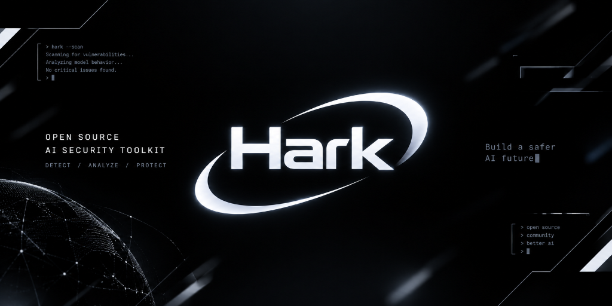
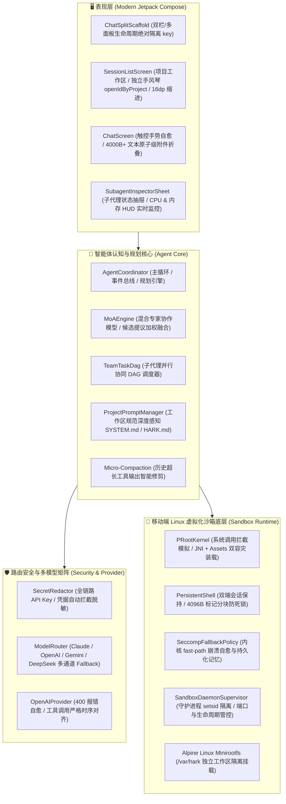

# Hark Agent Mobile (Hark)

<p align="center">
  
</p>

<p align="center">
  
</p>

<p align="center">
  <b>极速、全能、拥有完整独立 Linux 终端运行环境与多智能体协同引擎的移动端自主 AI Agent 操作系统</b>
</p>

<p align="center">
  <a href="https://github.com/Minglink/hark-agent-mobile/releases"></a>
  <a href="LICENSE"></a>
  <a href="#"></a>
  <a href="#"></a>
  <a href="#"></a>
  <a href="https://qm.qq.com/cgi-bin/qm/qr?k=&jump_from=webapi&authKey=&noverify=0&group_code=338431075"></a>
</p>

---

## 🌟 什么是 Hark Agent Mobile？

**Hark** 是专为现代移动终端深度定制的**自主型（Autonomous）AI 智能体操作系统**。

与市面上单纯调用远程 API 的 Web 套壳或问答机器人不同，**Hark 的核心设计哲学是将真正的通用计算环境赋予 AI** —— 让大语言模型在手机本地拥有一套真实的、免 Root 的 **Alpine Linux 完整用户空间与独立终端沙箱**。

在 Hark 中，AI 智能体不仅仅回答问题，更能：
1. **自主拆解复杂工程**：自发编写 Python/Shell/NodeJS 脚本并在本地沙箱即时运行与调试；
2. **免 Root 包管理**：直接通过 `apk add` 或 `pip install` 自主安装 Git、cURL、FFmpeg、Pandas 等任意生产力工具；
3. **团队协作（Multi-Subagent & MoA）**：根据任务难度自主孵化专业子代理（编码专家、代码审查、数据分析员等），基于 DAG 有向无环图调度器并行作业；
4. **工作区多层级穿透**：深度感知项目根目录工程规范（`SYSTEM.md` / `PROJECT_PROMPT.md`），在专属项目沙箱中无冲突执行；
5. **设备级原生调度**：具备无头与可视化双模自动化浏览器（Browser Use）和屏幕无障碍交互（PhoneAgent）。

---

## 📊 核心优势对比（Hark vs 传统移动端 AI 应用）

| 维度对比 | 传统套壳 AI 聊天 App | 传统移动代码工具 (如 Termux) | **Hark Agent Mobile (1.1.0)** |
| :--- | :--- | :--- | :--- |
| **底层环境** | 仅纯文本对话，无运行环境 | 仅终端 CLI，无自主 Agent 协作 | **内置免 Root 真实 Alpine Linux PRoot 沙箱** |
| **代码执行** | 无法运行代码或依赖受限远程容器 | 需人工逐条手敲命令 | **AI 自发编写、安装依赖、执行、捕获报错并自愈** |
| **多智能体架构** | 仅单轮/单模型对话 | 无 | **内置 MoA 混合专家引擎与 DAG 多子代理团队协同** |
| **项目工作区** | 扁平历史记录，无项目作用域概念 | 纯目录结构，与模型割裂 | **多级工作区穿透、独立沙箱挂载、草稿自动继承** |
| **规范感知** | 依赖用户反复输入 Prompt | 无 | **自动递归加载 `.hark/PROJECT_PROMPT.md` 等规范** |
| **UI 交互架构** | 频繁重载、跨会话污染与闪烁 | 传统字符终端 | **Compose 触控手势动态自愈、双栏生命周期隔离** |
| **隐私与安全** | 明文发送，易泄漏敏感 Key | 本地执行，无云端审计 | **全链路 `SecretRedactor` 敏感凭据自动脱敏过滤** |
| **网络鲁棒性** | 超时报错即中断任务 | 无 | **模型自动 Fallback 容灾 + 4096B 分块防死锁机制** |

---

## 🏗️ 系统全景架构设计

Hark 采用高内聚、松耦合的现代化移动端智能体架构体系：


```mermaid
graph TD
    subgraph UI_Layer ["🖥️ 表现层 (Modern Jetpack Compose)"]
        SplitScaffold["ChatSplitScaffold (双栏/多面板生命周期绝对隔离 key)"]
        SessionTree["SessionListScreen (项目工作区 / 独立手风琴 openIdByProject / 16dp 缩进)"]
        ChatInput["ChatScreen (触控手势自愈 / 4000B+ 文本原子级附件折叠)"]
        HUD["SubagentInspectorSheet (子代理状态抽屉 / CPU & 内存 HUD 实时监控)"]
    end

    subgraph Agent_Core ["🧠 智能体认知与规划核心 (Agent Core)"]
        AgentCoordinator["AgentCoordinator (主循环 / 事件总线 / 规划引擎)"]
        MoA["MoAEngine (混合专家协作模型 / 候选提议加权融合)"]
        DAG["TeamTaskDag (子代理并行协同 DAG 调度器)"]
        ProjectPrompt["ProjectPromptManager (工作区规范深度感知 SYSTEM.md / HARK.md)"]
        Compressor["Micro-Compaction (历史超长工具输出智能修剪)"]
    end

    subgraph Security_Provider ["🛡️ 路由安全与多模型矩阵 (Security & Provider)"]
        SecretRedactor["SecretRedactor (全链路 API Key / 凭据自动拦截脱敏)"]
        Router["ModelRouter (Claude / OpenAI / Gemini / DeepSeek 多通道 Fallback)"]
        ToolSanitizer["OpenAIProvider (400 报错自愈 / 工具调用严格时序对齐)"]
    end

    subgraph Sandbox_Kernel ["🐧 移动端 Linux 虚拟化沙箱底层 (Sandbox Runtime)"]
        PRootKernel["PRootKernel (系统调用拦截模拟 / JNI + Assets 双容灾装载)"]
        Shell["PersistentShell (双端会话保持 / 4096B 标记分块防死锁)"]
        Seccomp["SeccompFallbackPolicy (内核 fast-path 崩溃自愈与持久化记忆)"]
        Supervisor["SandboxDaemonSupervisor (守护进程 setsid 隔离 / 端口与生命周期管控)"]
        Rootfs["Alpine Linux Minirootfs (/var/hark 独立工作区隔离挂载)"]
    end

    UI_Layer --> Agent_Core
    Agent_Core --> Security_Provider
    Agent_Core --> Sandbox_Kernel
```

---

## 🔥 核心架构深度剖析

### 1. 🐧 免 Root 真实 Linux 沙箱（PRoot Syscall 模拟引擎）
* **真·用户空间虚拟化**：基于定制编译的 `libproot.so` 原生库与静态链接二进制，通过 `ptrace` 机制全面拦截并仿真文件系统与系统调用，无需手机 Root 权限即可提供完整的 Linux POSIX 接口。
* **双容灾装载架构（Dual-Fallback Architecture）**：
  * **主通道**：启动时优先从 Android 原生 JNI 目录加载高效的 `libproot.so`；
  * **容灾兜底**：当遇到定制系统（ROM）权限限制或动态库提取异常时，系统自动从 `assets/proot-aarch64` 无缝提取并动态授予执行权限，确保 100% 装载成功率。
* **Seccomp Fast-Path 崩溃自愈与持久化记忆**：
  * 针对部分高版本 Linux 内核对 Seccomp 快速路径的系统调用编译差异，内置 `SeccompFallbackPolicy`。
  * 首次检测到子进程早期异常退出（SIGSYS/SIGSEGV）时，自动触发重试并启用 `PROOT_NO_SECCOMP=1`；同时将该硬件特征**持久化保存至安全偏好存储**中，保证后续启动即刻生效，彻底杜绝崩溃死循环。
* **4096B 字节边界切断防死锁（PersistentShell Chunk Boundary Defense）**：
  * Linux PTY 管道缓冲区在 4096 字节边界处可能将完成标记（如 `__MINIS_DONE`）斩断在两个数据包中。
  * Hark 实现了滑动窗口环形缓冲（Sliding Stream Buffer），在数据包截断时自动对齐，彻底消除传统移动端沙箱在超长脚本输出时假死超时的顽疾。
* **守护进程 PID 独立隔离**：
  * 通过 `hark-service` 结合 `setsid` 运行后台常驻任务，并在 PRoot 内部独立命名空间中精准管理进程，防止宿主 Android 杀进程时误杀正在执行的构建任务。

---

### 2. 👥 多子代理团队协同与混合专家架构（Multi-Subagent & MoA）
* **分布式任务解耦**：面对大型项目时，主代理通过 `DelegateTaskTool` 工具自发建立轻量级 Subagent；
* **团队 DAG 调度器（TeamTaskDag）**：支持复杂的依赖调度（例如：架构规划 -> [代码实现A, 代码实现B] 并行 -> 统一代码审计）；
* **混合专家模型（MoAEngine）**：支持将同一个任务同时分发给不同模型通道（如 Claude-3.7-Sonnet 与 GPT-4o），利用提议聚合算法甄选最佳代码输出；
* **独立上下文隔离与资源看板**：
  * 每个子代理拥有完全隔离的推理上下文与局部变量，杜绝历史会话相互污染；
  * 前台配备 `SubagentStatusBar` 状态栏与 `SubagentInspectorSheet` 检查抽屉，可实时查看每个子代理的思考过程、终端输出与 CPU/内存 HUD 开销；
  * **开箱即用自动回退（Zero-Barrier Default）**：即便用户未手动配置模型白名单，系统自动将所有已启用模型纳入调度池，杜绝“找不到可用子代理模型”的困扰。

---

### 3. 📁 项目工作区多层级穿透与规范深度感知
* **独立工作区安全隔离**：
  * 每个项目拥有独立的宿主物理路径与沙箱映射路径（`/var/hark/projects/{projectName}`），沙箱间文件互不干扰。
  * 严谨的物理挂载去重机制，防止物理路径与沙箱路径重叠引发系统 EINVAL 挂载冲突。
* **工作区规范深度感知（ProjectPromptManager）**：
  * 自动递归扫描工作区根目录中的规范配置文件：优先识别 `.hark/PROJECT_PROMPT.md`、`SYSTEM.md`、`HARK.md`、`CLAUDE.md`；
  * 自动将团队编码准则、架构分层规范、技术选型要求无缝注入模型上下文，让 Agent 产出的每一行代码都符合您的项目标准。
* **项目层级视觉缩进与草稿继承**：
  * 会话树采用优雅的 **16dp 层级缩进**（`inProject = true`），结构清晰分明；
  * 会话列表手风琴采用按项目隔离模型（`openIdByProject`），各项目展开折叠互不干扰，配合持久化记忆（`expandedProjectIds`），屏幕旋转或重启均不丢失浏览进度；
  * 在项目内点击新建时，自动继承当前工作区上下文，新草稿直接归属于对应项目。

---

### 4. ⚡ Compose 触控自愈与多面板隔离 UI
* **手势全动态绑定自愈（PointerInput Lifecycle Self-Healing）**：
  * 针对 Jetpack Compose 在复杂列表滑动与重组时容易捕获陈旧闭包导致长按失灵的问题，全面重构 `FolderCard`、`SessionRow` 与底栏手势监听；
  * 手势 key 动态绑定实体 ID 与状态变量（`.pointerInput(session.id, onClick, onLongClick)`），杜绝手势死锁。
* **双栏/多面板生命周期绝对隔离**：
  * 平板与大屏模式下，`ChatSplitScaffold` 使用 `key(sessionId)` 封装 `detailPane`；
  * 切换会话时底层强制销毁并重建会话局部作用域与输入框状态，根除不同会话间的输入残留、草稿覆盖与重组闪烁。
* **原子级超长文本安全折叠（Atomic Paste Folding）**：
  * 粘贴超过 4000 字符的大段代码或日志时，系统在后台原子化存为附件文件并转化为 Chip 标签；
  * 同步清空输入框文本，彻底修复同类软件中“同时生成附件又发送文本标记”导致的内容双重发送 Bug。
* **Markdown 高性能缓存渲染**：
  * 对大型表格解析（AST 分析与正则匹配）加入 `remember` 级缓存，移出 Draw 绘制阶段，消除长文档快速滚动时的掉帧卡顿。

---

### 5. 🛡️ 安全防御体系与数据脱敏（SecretRedactor）
* **敏感信息全链路过滤**：
  * 内置 `SecretRedactor` 智能敏感词引擎；
  * 在向云端 API 发送请求前，自动拦截并脱敏对话消息、System Prompt 及工具执行日志中的 API Key、密码、JWT Token 和鉴权头，确保开发者数据资产安全。
* **OpenAI 协议时序自愈**：
  * 针对 OpenAI 规范中 Assistant `tool_calls` 与 Tool Response 必须严格连续的要求，内置排序与时序重构算法；
  * 自动重排被延后插入的图片消息，修复因网络中断缺失的工具回执，根治令人头痛的 HTTP 400 报错。

---

## 🛠️ 丰富强大的原生工具箱

| 工具标识符 | 描述与能力范围 | 执行环境 |
| :--- | :--- | :--- |
| `bash` | 在真实 Alpine Linux 沙箱内执行任意 Shell / CLI 命令 | 沙箱内 (PRoot) |
| `file_read` / `file_edit` | 读写、正则替换、精准修补沙箱及工作区文件 | 沙箱/本地 |
| `directory_list` / `find_by_name` | 递归遍历工作区，支持通配符与元数据筛选 | 沙箱/本地 |
| `grep_search` | 高性能正则检索工作区代码库中的文本与符号 | 沙箱 (ripgrep) |
| `browser_action` | 控制无头浏览器导航、DOM 提取、表单输入与截图 | 独立容器 |
| `todo_write` | 创建、更新分阶段工程目标与执行任务卡片 | 代理核心 |
| `delegate_task` | 调度与衍生专业子代理团队，并行分配工作任务 | 核心协作 |

---

## 📲 下载与安装

您可直接前往本仓库的 **[Releases 页面](https://github.com/Minglink/hark-agent-mobile/releases)** 获取最新的预编译安装包：

* **[Hark-1.1.0.apk](https://github.com/Minglink/hark-agent-mobile/releases/download/v1.1.0/Hark-1.1.0.apk)**（推荐：采用「白卡蓝」精美视觉设计，全面融入工作区多层级穿透、Compose 触控自愈、多面板生命周期绝对隔离架构；内置稳定 Linux 沙箱、多智能体团队协作与敏感数据脱敏）

> **[可选验证] 签名与完整性保障**：
> 本安装包采用 Android 标准 **v2 + v3 全签名体系**，并严格执行 4 字节（4-byte boundary）`zipalign` 对齐与 JNI Legacy 打包标准，完美兼容各种主流 Android 设备与主流厂商定制 ROM（HarmonyOS / HyperOS / OriginOS / ColorOS 等）。

---

## 💻 从源码构建 (Android)

### 环境准备
* **JDK**：OpenJDK 17 或以上
* **Android SDK**：`compileSdk = 36`, `targetSdk = 35`, `minSdk = 26`
* **Android NDK**：`27.0.12077973` 或以上
* **CMake**：`3.22.1` 或以上

### 编译步骤
```bash
# 1. 克隆代码仓库
git clone https://github.com/Minglink/hark-agent-mobile.git
cd hark-agent-mobile

# 2. 进入 Android 模块目录
cd src/android

# 3. 运行全量单元测试 (1316+ 测试)
./gradlew testReleaseUnitTest

# 4. 构建发布版 Release APK
./gradlew assembleRelease

# 编译生成的 APK 文件位于:
# src/android/app/build/outputs/apk/release/app-release.apk
```

---

## 📁 代码目录规范

```text
hark-agent-mobile/
├── assets/                     # 宣传 Banner、品牌 Logo 等视觉资源
├── Hark-1.1.0.apk              # 根目录预编译发布版 Release 安装包
├── src/
│   ├── android/                # Android 核心应用源码 (Kotlin + Compose + JNI C++)
│   │   ├── app/src/main/
│   │   │   ├── java/com/openminis/app/
│   │   │   │   ├── agent/      # 智能体核心、团队 DAG、MoA 引擎与规划系统
│   │   │   │   ├── sandbox/    # Linux PRoot 沙箱内核、挂载隔离与守护调度
│   │   │   │   ├── tools/      # Agent 原生工具集与 DelegateTaskTool
│   │   │   │   ├── security/   # SecretRedactor 敏感数据脱敏与完整性校验
│   │   │   │   ├── provider/   # LLM 多厂商驱动适配 (OpenAI/Claude/Gemini/DeepSeek)
│   │   │   │   └── ui/         # 白卡蓝 UI 界面、ChatSplitScaffold 双栏与主题
│   │   │   ├── assets/         # 沙箱预置环境 (alpine-minirootfs.tar.gz / proot-aarch64)
│   │   │   └── jniLibs/        # arm64-v8a 高性能 PRoot 原生库 (libproot.so)
│   ├── ios/                    # iOS 应用源码 (Swift + SwiftUI + iSH)
│   └── shared/                 # 跨端公共协议与预置资源
├── deps/                       # 本地沙箱与底层依赖构建脚本
├── scripts/                    # 自动化打包与开发辅助脚本
└── README.md                   # 项目核心技术文档与使用手册
```

---

## 💬 社区与技术交流

如果您在使用过程中遇到任何问题，或对底层虚拟化与智能体算法有优化思路，欢迎加入交流或提交 PR：

* **官方交流 QQ 群**：**`338431075`**
* **GitHub Issues**：[提交 Bug 报告与功能需求](https://github.com/Minglink/hark-agent-mobile/issues)
* **GitHub Discussions**：[参与架构讨论与使用心得分享](https://github.com/Minglink/hark-agent-mobile/discussions)

---

## 📄 开源许可证

本项目基于 **[CC BY-NC-SA 4.0](LICENSE)**（知识共享 署名-非商业性使用-相同方式共享 4.0 国际许可协议）开源。  
第三方组件与依赖遵循其各自的原生开源协议，详见 [THIRD_PARTY_LICENSES.md](THIRD_PARTY_LICENSES.md)。
